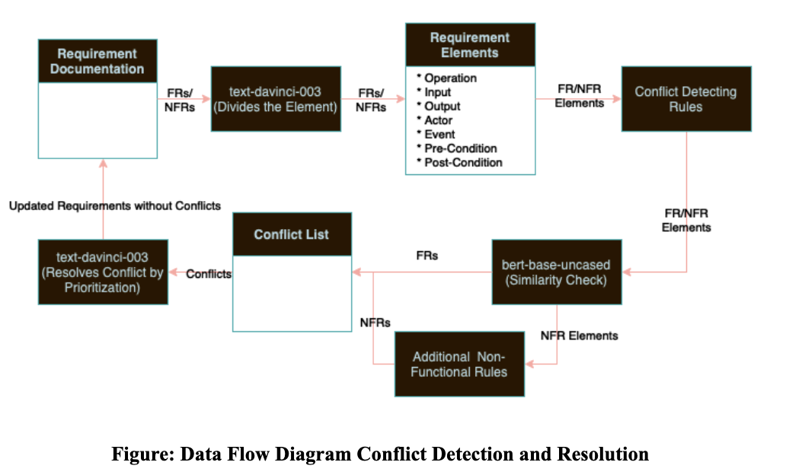
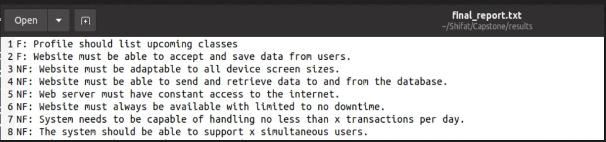
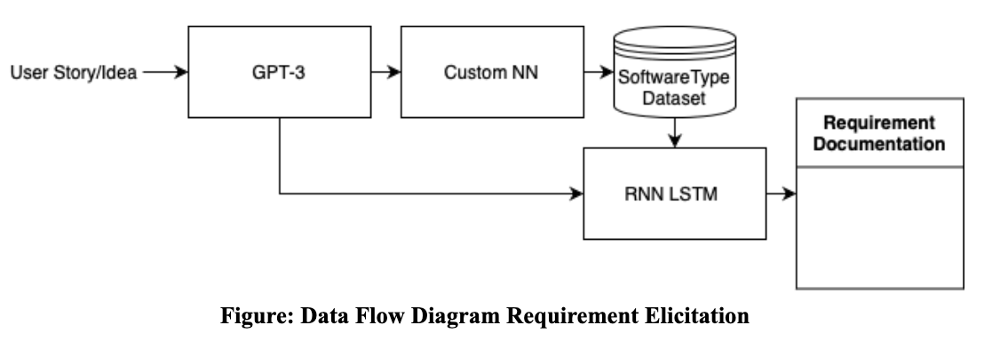
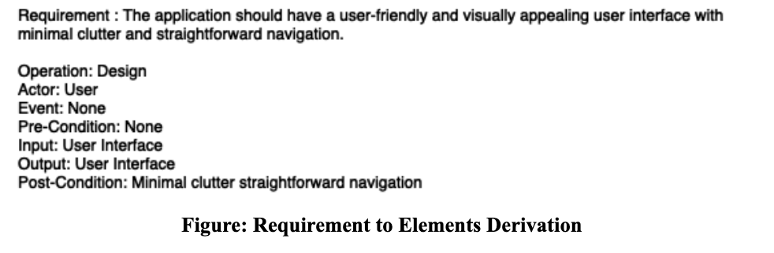

# Automated Requirement Engineering Toolkit

The Automated Requirement Engineering Toolkit is a powerful software solution that leverages cutting-edge machine learning and natural language processing techniques to revolutionize requirement engineering. With three distinct deep-learning models at its core, the toolkit automates requirement elicitation, classification, conflict detection, and resolution. The first model, powered by DaVinci003, directly generates requirements from user input, even accommodating vague ideas. The second model employs a custom neural network to classify similar software types, fetching related requirements from a dataset. A third model, based on RNN-LSTM, classifies requirements as functional or non-functional. This comprehensive toolkit also excels in conflict detection and resolution. It systematically converts natural language requirement statements into elements, analyzes them with predefined rules, and offers efficient conflict resolution methods. By prioritizing and adjusting conflicting requirements based on system type, the toolkit ensures coherence while maintaining accuracy and effectiveness.

* Contributions of Toolkit
  * Fully Automated Requirement Elicitation Tool
  * Simple Ill-Formed Idea is enough to start Requirement Elicitation process.
  * Finding Requirements from Software Type.
  * Dataset of Requirement and Software Type.
  * Fully-Automated Requirement Engineering Open-source Toolkit
  * Used NLP techniques to automatically generate individual elements like Operation, Input/Output, Actor from Requirement Statements.
  * Rule-Based Approach applied for NFR Conflicts.
  * Requirement Resolution through Merging and Prioritization

* Requirement Elicitation and Classification
![Alt Text]

Sample User Idea
'''
I want my profile to list my upcoming classes and include a link to a detailed page about each so that prospective attendees can find my courses.
'''
Generates...

* Requirement Conflict Detection

The conflict is detected via a rule based approach from elements found after dividing Requirement Statements. Rules are added for both Functional and Nonfunctional Requirement Conflicts. The reason why rules detect conflicts are used to either generate an altered requirement statement, merge two requirements using the help of a common element and remove lower priority requirements.

Example 1
'''
F: The user can save the output PDF files in a directory they want.
F: Users can extract some sections of a PDF document into a single document.
Reason: The operations are different but the post-conditions are the same.
Resolved Statement: The user should be able to select sections of a PDF document and merge them into a single document, which they can then save to a directory of their choice.
'''

Example 2
'''
F: The DigitalHome System shall allow a web-ready computer, cell phone or PDA to control a home's temperature, humidity, lights, security, and the state of small appliances.
F: The communication center of the DH system shall be a DH home web server, through which a user shall be able to monitor and control home devices and systems.
Reason: The operations are the same but the actors are different.
Resolved Statement: The communication center of the DH system shall be a DH home web server, through which a user shall be able to monitor and control home devices and systems.
'''

Further Advancement Area
- Needs more data for Software Type based Dataset.
- GUI and better display of generated requirements and all available functionalities.
- Manually devise dataset to fine tune model for element conversion.
- Add new rules to rule-base after discussion with professionals in the field of Requirements Engineering.
- Further evaluate usability, efficiency, and effectiveness of entire automation tool.
- Find rules that limits False Positive conflicts

Tool Installation
Step 1: Download all the files and install the requirements.txt file in your environment.
Step 2: To run the program, you need your own DaVinci API code that needs to be updtaed in the gpt.py file.
Step 3: Go to file directory by terminal and run "python3 main.py 'User_Story'" for automated requirement generation and classification
Step 4: Run "python3 mainv2.py" for automated conflict detection and resolution. Provide iteration number when the interface asks for it. Use iteration 2 as iteration 1 results in a lot of false positive conflicts. Keep iterations upto 4 as further iterations will ruin the requirement set.
You can see the conflicts generated in the conflicts.txt file. 
Results folder will automatically store generated results.
Happy Requiremnt Engineering!!!
